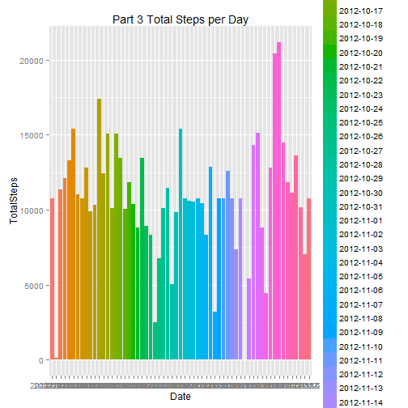

## Introduction
        This assignment uses data from a single personal activity monitoring device
        collected over 2 months during Oct and Nov 2012.  

## Methods
        The methods used in this assignment include RStudio, RMarkdown and knitr.  

## Results
        The results for this assignment are output to the document and
        are included inline with questions for each part of the assignment.   

## Background  
#### Dataset: Activity monitoring Data
#### Rows: 17,568  
#### Features:  3 including:
        Steps:  Number of steps taken in a 5 minute interval  
        Date:  Date on wich the measurement was taken YYYY-MM-DD format  
        Interval: Identifier for 5 minute interval in which measurement was taken  


## Prepare for analysis and set global options

```r
library("knitr")
opts_chunk$set(echo = TRUE)
```

        install.packages("data.table")     
        install.packages("xtable")  
        install.packages("ggplot2")  
        library(data.table)  
        library(xtable)  
        library(ggplot2)  

## Read, load,and preprocess data 
        Unzip the activity file  
        Read the data into R  
        Summarize the data  
        Convert data to a dataframe

```r
        unzip("activity.zip", overwrite="TRUE")
        activity_data <- read.csv("./activity.csv")  
        summary(activity_data)
```

```
##      steps               date          interval   
##  Min.   :  0.0   2012-10-01:  288   Min.   :   0  
##  1st Qu.:  0.0   2012-10-02:  288   1st Qu.: 589  
##  Median :  0.0   2012-10-03:  288   Median :1178  
##  Mean   : 37.4   2012-10-04:  288   Mean   :1178  
##  3rd Qu.: 12.0   2012-10-05:  288   3rd Qu.:1766  
##  Max.   :806.0   2012-10-06:  288   Max.   :2355  
##  NA's   :2304    (Other)   :15840
```

## What is mean total number of steps taken per day?
        For Part 1 the following steps are taken
                1. Make a histogram for total number of steps taken each day using ggplot2 
                        which requires data in a data frame
                2. Aggregate Total Steps by Date and calculate mean  
                3. Sort data set by Steps (required for median), and calculate median 
                4. Report on the two data points          


```r
        library(ggplot2)
        pData <- aggregate(activity_data$steps, by=list(activity_data$date), sum, na.rm = TRUE)
        names(pData) <- c("Date", "TotalSteps") 
        ggplot(data = pData, aes(x=Date, y=TotalSteps, fill=Date)) + geom_bar(stat="identity")+ ggtitle("Part 1 Total Steps per Day")
```

 

```r
        activity.df <- data.frame(activity_data) 
        totalsteps <- aggregate(steps ~ date, activity.df, sum )  
        meansteps <- mean(totalsteps$steps)
                        
        totalsorted <- totalsteps[order(totalsteps$steps), ] 
        mediansteps <- median(totalsorted$steps)
```

        The median number of steps is 10765                              
        The mean number of steps is 10766.1886792453                            

## What is the average daily activity pattern?
        For Part 2, the following steps are taken
                1. Take average number of steps for each time interval
                2. Plot the intervals on the x axis and the averages on the y axis
                

```r
        pData <- aggregate(activity_data$steps, by=list(activity_data$interval), sum, na.rm = TRUE )  
        names(pData) <- c("Intervals", "AverageSteps") 
        g <- ggplot(data = pData, aes(x=factor(Intervals), y=AverageSteps)) 
        ggplot(data = pData, aes(x=Intervals, y=AverageSteps)) + 
                geom_line(colour="blue") + geom_point(colour="blue", shape=21, fill="white") + 
                ggtitle("Part 2 Time Series Avg Steps Per Interval")
```

 

```r
        x <- max(pData$AverageSteps)
        maxpData <- pData[pData$AverageSteps ==x, ]
        y <- maxpData$Intervals
```
   
        Part 2 Question: Which 5 minute interval, on average across all days in the dataset, contains the max number of steps?   835


## Imputing missing values
        For Part 3, the following steps are taken:
                1. Calculate and report the total of missing values in the dataset
                2. Replace missing values with the mean value for each 5 minute session
                3. Create a new data set that merges the mean value into the original data
                4. Create a histogram of total number of steps taken each day  
                5. Calculate and report mean and median for total number of steps
                6. Do these values differ from estimates in Part 1?
                7. What is the impact of imputing missing data on the estimates?
        

```r
        x <- is.na(activity_data)
        y <- sum(x)

        pData <- aggregate(activity_data$steps, by=list(activity_data$interval), mean, na.rm = TRUE )  
        names(pData) <- c("Interval", "Mean") 
        combinedData <- merge(pData, activity_data, by.x="Interval", by.y="interval", all = FALSE)

        x1 <- is.na(combinedData)
        y1 <- sum(x1)
        combinedData$steps[is.na(combinedData$steps)] <- combinedData$Mean[is.na(combinedData$steps)]
        names(combinedData) <- c("Interval", "Mean", "Steps", "Date") 
        x2 <- is.na(combinedData)
        y2 <- sum(x2)

        pData <- aggregate(combinedData$Steps, by=list(combinedData$Date), sum )  
        names(pData) <- c("Date", "TotalSteps") 

        ggplot(data = pData, aes(x=Date, y=TotalSteps, fill=Date)) + geom_bar(stat="identity")+ ggtitle("Part 3 Total Steps per Day")
```

 

```r
        meansteps2 <- mean(pData$TotalSteps)          
        totalsorted <- pData[order(pData$TotalSteps), ] 
        mediansteps2 <- median(totalsorted$TotalSteps)
```
        The number of missing values in the original data set is 2304  
        The original mean calculation is 10766.1886792453.   The new mean calculation is 10766.1886792453    
        The original median calculation is 10765. The new median calcuation is 10766.1886792453    
        
        Part 3 Question: Do these values differ from the estimates from Part 1 of the assignment?  
                The mean calculation is the same. The median calculation is not the same.   
        Part 3 Question: What is the impact of imputing missing data on estimates of total daily number of steps?  
                The impact seems small.
        
## Are there differences in activity patterns between weekdays and weekends?
        For Part 4, the following steps are taken:
                1. Create a new factor variable in data set with 2 levels: weekday and weekend
                2. Make a panel plot containg time series averaged across weekdays or weekend days  
                
 
 ```r
        newData <- combinedData       
        newData$day <- weekdays(as.Date(newData$Date))       
        newData$Type <- ifelse(newData$day == "Saturday" | newData$day == "Sunday", "Weekend", "Weekday")  
        pData <- aggregate(newData$Steps, by=list(newData$Type, newData$Interval), FUN = mean )    
        names(pData) <- c("Type", "Interval", "AverageSteps")
        g <- ggplot(data = pData, aes(x=Interval, y=AverageSteps)) + ggtitle("Part 4 Panel Plot")    
        g + geom_line(colour="blue") + geom_point(colour="blue", shape=21, fill="white") + facet_grid(Type ~ .)  
 ```
 
  
        
        Part 4 Question:  Are there differences in activity patterns between weekdays and weekends?   Yes.
                
